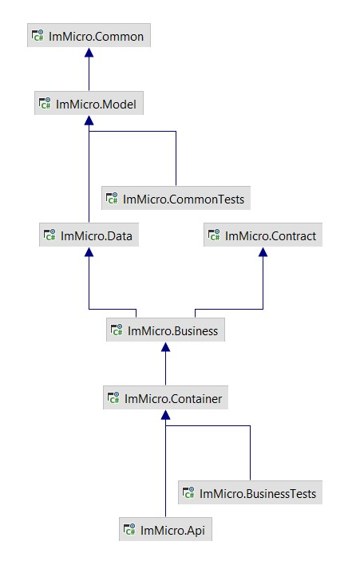
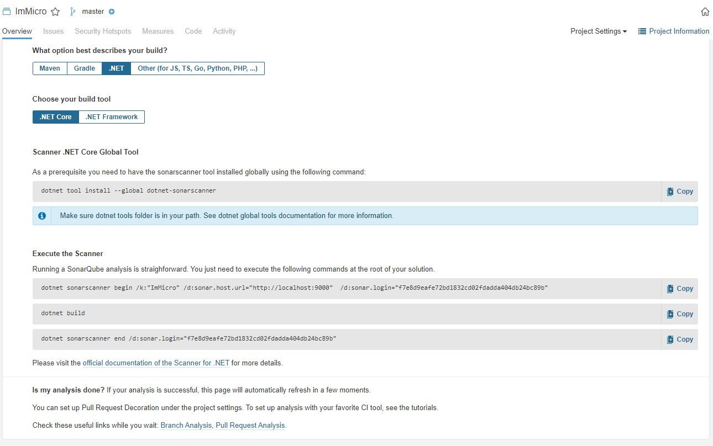
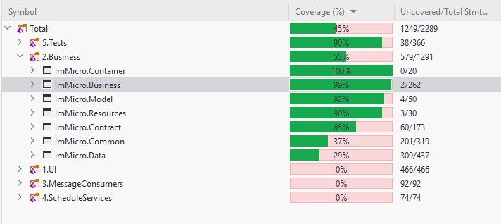
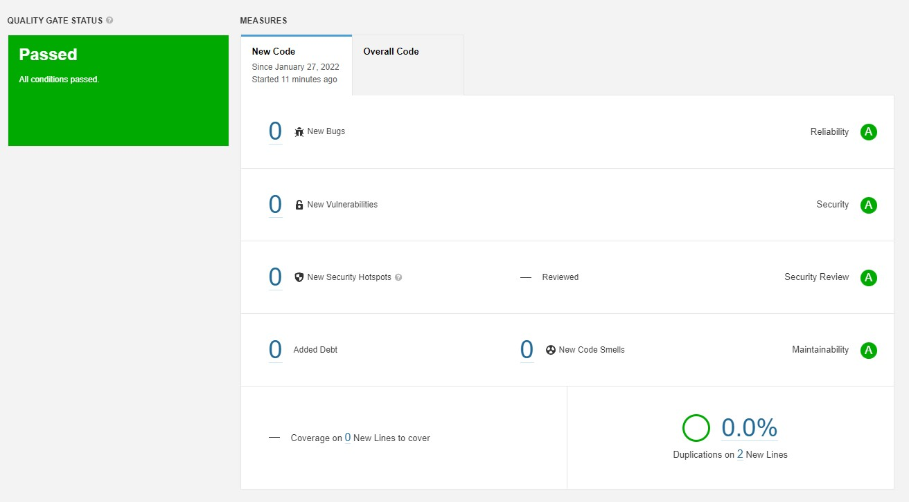

#   **ImMicro**
    
This is a simple/reusable micro/macro service template/playgorund project.  
   

#### Features
- Simple Login flow
- User List(Search), CRUD flow
- AuditLog List(Search), Export, Get flow
- Product List(Search), CRUD flow
- MessageQueue sample flow
- Multi Language support

#### Structure
- **API:** Endpoint project for client usage  
- **Business:** Project for business logic        
- **Common:** Cross cutting consern items (like cache, lock...)   
- **Container:** DI configuration project   
- **Contract:** Dtos, layer transfer and api response - request objects   
- **Data:** Database layer files (Ef(Core) implementations and repositories)    
- **Model:** Database entity models   
- **Resources:** Language resx files project   
- **Messaging/Consumer:** Message service(RabbitMQ) implementation project
- **ScheduleService:** Schedule tasks project   
- **Tests:** Unit and Benchmark test projects   
  

#### Technologies

* .Net 6.0 - C# 10.0
* Asp .Net Health Check  
* EF Core 6.0  
* Postgres Sql  
* Redis 
* RabbitMQ
* MassTransit
* Hangfire  
* Serilog  
* NWebSec  
* Autofac  
* FluentValidation  
* Swagger  
* RedLock  
* AutoMapper  
* Docker
* BenchmarkDotNet
* HelpersToolbox (https://github.com/turhany/HelpersToolbox)
* Filtery (https://github.com/turhany/Filtery)
* Audity (https://github.com/turhany/Audity)
* Exporty (https://github.com/turhany/Exporty)

#### Before Usage
* If you want to use local environment, you need to update Redis and PostgreSql connection strings in API project  (appsettings.json)    
    * **DBConnectionString** field for PostgreSql
    * **RedisConnectionString** field for DistributedCache
    * **Distributed Lock Settings (RedLockSettings)**
        * RedLockHostAddress
        * RedLockHostPort
        * RedLockHostPassword > if you dont have pass you need to set it null
        * RedLockHostSsl  
    * **Message Queue Settings (RabbitMqSettings)**
        * HostAddress
        * UserName
        * Password
        * Also need to add your queue names here like "SampleQueue" and in C# "RabbitMqOption" class for option mapping
* Also project has ready to run **Docker support**
    * **docker-compose file store in solution directory**
    * All connection string stores in appsettings.DockerCompose.json environment file

#### For local Development - Docker Run Codes
* **PostgreSQL >**  docker run --name postgressqlcontainer -p 5432:5432 -e POSTGRES_PASSWORD=123456789.tY -d postgres
* **Redis >** docker run --name redis -p 6379:6379 -d redis --requirepass 123456789.tY
* **RabbitMQ >** docker run -d --hostname rabbitmq --name rabbitmq -p 15672:15672 -p 5672:5672 rabbitmq:3.8.3-management 
    * Default username and password: guest

#### GUI's
* For DB > https://dbeaver.io
* For Redis > https://github.com/qishibo/AnotherRedisDesktopManager

#### SonarQube Test Preperation
* docker run -d --name sonarqube -e SONAR_ES_BOOTSTRAP_CHECKS_DISABLE=true -p 9000:9000 sonarqube:latest
* SonarQube need java install it before continue https://www.oracle.com/java/technologies/downloads/
* SonarQube Url: http://localhost:9000 
    * Username: admin
    * Password: admin
* Open SonarQube and login the system
* Select "Manually" project type
* Fill the "Display Name" and "Key" area for example "ImMicro" and clik setup
* Select "Locally" option
* Fill "Token Name" for example "ImMicroToken" and click generate
* Then you will see you token copy it and click continue
* Select ".Net" after that select ".Net Core" build tool then you will see you SonarQube run commands like this ss
* Open command propt in your app foler and run them step by step
  

#### EF Migration Codes
* update-database -context ImMicro.Data.DataContext
* add-migration migrationName -context ImMicro.Data.DataContext

#### Usages
* Application has multi language support for demo pupose now TR and EN
* Before request auth need endpoints like User and Product endpoints first need to Login over login/token enpoint
    * **Accept-Language** can set "tr-TR" or "en-US"
    * **Login Email:** user@immicro.com
    * **Login Pass:** 123456789.tY
* When you get token from **login/token** Endpoint **"accessToken"** field can set swagger **"Authorize"** area with **"Bearer {accessToken}"** syntax

#### Swagger Endpoint   
* http://localhost:5000/swagger/index.html

#### Schedule Service Hangfire Endpoint   
* http://localhost:5001/hangfire

#### Healt Check Endpoints   
* http://localhost:5000/health-check    > json response endpoint for health information
* http://localhost:5000/health-check-ui > Dashboard for see application services health (Redis, NpgSql)    

#### Code Coverage
  

#### SonarQube Test Results
  

