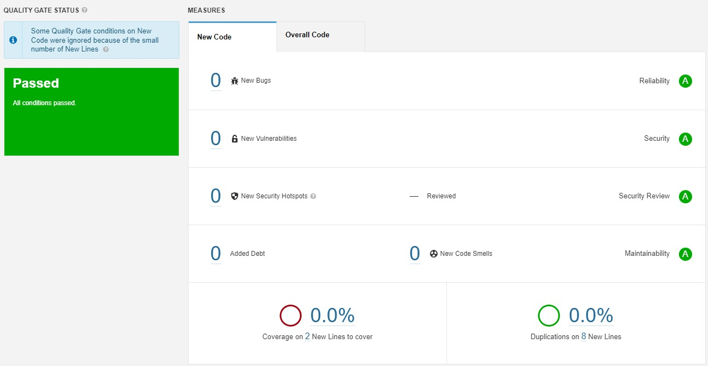

#   **ImMicro**
  

This is a simple/reusable micro/macro service template/playground project.  

#### Features
- Simple Login flow
- User List(Search), CRUD flow
- AuditLog List(Search), Export, Get flow
- Product List(Search), CRUD flow
- MessageQueue flow
- AOP flow (PerformanceAspect)
- Multi Language support
- Api Versionun 
- Rate Limiting (InMemory mode)
- Swagger implementation
- Hangfire background task flow
- Unit/Benchmark Test projects

#### Structure
- **API:** Endpoint project for client usage  
- **Business:** Project for business logic        
- **Common:** Cross cutting consern items (like cache, lock...)   
- **Container:** DI configuration project   
- **Contract:** Dtos, layer transfer and api response - request objects   
- **Data:** Database layer files (Ef(Core) implementations and repositories)    
- **Model:** Database entity models   
- **Resources:** Language resx files project   
- **Messaging/Consumer:** Message service(RabbitMQ) implementation project
- **ScheduleService:** Schedule tasks project   
- **Tests:** Unit and Benchmark test projects   
  

#### Technologies

* .Net 6.0 - C# 10.0(https://dotnet.microsoft.com/en-us/download/dotnet)
* Asp .Net Health Check (https://github.com/Xabaril/AspNetCore.Diagnostics.HealthChecks)  
* EF Core 6.0  (https://docs.microsoft.com/en-us/ef/core/)
* PostgreSql (https://www.postgresql.org/)  
* MongoDB (https://www.mongodb.com/)  
* Dapper (https://github.com/DapperLib/Dapper)
* Redis (https://redis.io/) 
* RabbitMQ (https://www.rabbitmq.com/)
* MassTransit (https://masstransit-project.com/)
* Hangfire (https://www.hangfire.io/)  
* Serilog (https://serilog.net/)  
* NWebSec (https://www.nwebsec.com/)  
* Autofac (https://autofac.org/)  
* FluentValidation (https://fluentvalidation.net/)  
* Swagger (https://github.com/domaindrivendev/Swashbuckle.AspNetCore)  
* RedLock (https://github.com/samcook/RedLock.net)  
* AutoMapper (https://automapper.org/)  
* Docker (https://www.docker.com/)
* BenchmarkDotNet (https://benchmarkdotnet.org/)
* Throw (https://github.com/mantinband/throw)
* HelpersToolbox (https://github.com/turhany/HelpersToolbox)
* Filtery (https://github.com/turhany/Filtery)
* Audity (https://github.com/turhany/Audity)
* Exporty (https://github.com/turhany/Exporty)
* AspNetCoreRateLimit (https://github.com/stefanprodan/AspNetCoreRateLimit)

#### Before Usage
* If you want to use local environment, you need to update Redis and PostgreSql connection strings in API project  (appsettings.json)    
    * **DBConnectionString** field for PostgreSql
    * **RedisConnectionString** field for DistributedCache
    * **Distributed Lock Settings (RedLockSettings)**
        * RedLockHostAddress
        * RedLockHostPort
        * RedLockHostPassword > if you dont have pass you need to set it null
        * RedLockHostSsl  
    * **Message Queue Settings (RabbitMqSettings)**
        * HostAddress
        * UserName
        * Password
        * Also need to add your queue names here like "SampleQueue" and in C# "RabbitMqOption" class for option mapping
* Also project has ready to run **Docker support**
    * **docker-compose file store in solution directory**
    * All connection string stores in appsettings.DockerCompose.json environment file

#### For local Development - Docker Run Codes
* **PostgreSQL >**  docker run --name postgressqlcontainer -p 5432:5432 -e POSTGRES_PASSWORD=123456789.tY -d postgres
* **Redis >** docker run --name redis -p 6379:6379 -d redis --requirepass 123456789.tY
* **RabbitMQ >** docker run -d --hostname rabbitmq --name rabbitmq -p 15672:15672 -p 5672:5672 rabbitmq:3.10.1-management 
    * Default username and password: guest

#### GUI's
* For PostgreSQL > https://dbeaver.io
* For Redis > https://github.com/qishibo/AnotherRedisDesktopManager

#### SonarQube Test Preperation
* docker run -d --name sonarqube -e SONAR_ES_BOOTSTRAP_CHECKS_DISABLE=true -p 9000:9000 sonarqube:latest
* SonarQube need java install it before continue https://www.oracle.com/java/technologies/downloads/
* SonarQube Url: http://localhost:9000 
    * Username: admin
    * Password: admin
* Open SonarQube and login the system
* Select "Manually" project type
* Fill the "Display Name" and "Key" area for example "ImMicro" and clik setup
* Select "Locally" option
* Fill "Token Name" for example "ImMicroToken" and click generate
* Then you will see you token copy it and click continue
* Select ".Net" after that select ".Net Core" build tool then you will see you SonarQube run commands like this ss
* Open command propt in your app foler and run them step by step
  

#### EF Migration Codes
* update-database -context ImMicro.Data.DataContext
* add-migration migrationName -context ImMicro.Data.DataContext

#### Database Maintenance (PostgreSql)
``` sql
--ReIndex
REINDEX TABLE "AuditLog";
REINDEX TABLE "Category";
REINDEX TABLE "Product";
REINDEX TABLE "RequestLog";
REINDEX TABLE "User" ;

--Vacuum
Vacuum full Verbose "AuditLog";
Vacuum full Verbose "Category";
Vacuum full Verbose "Product";
Vacuum full Verbose "RequestLog";
Vacuum full Verbose "User";

-- Find Expensive Queries
SELECT queryid, calls, mean_time, substring(query for 100)
FROM pg_stat_statements 
ORDER BY total_time DESC LIMIT 3;

--Analyze Expensive Query Sample
--Online Suggestion Website > https://explain.depesz.com/
EXPLAIN ANALYZE SELECT * FROM "User" WHERE "Email" = 'user@immicro.com';
```   

#### Usages
* Application has multi language support for demo pupose now TR and EN
* Before request auth need endpoints like User and Product endpoints first need to Login over login/token enpoint
    * **Accept-Language** can set "tr-TR" or "en-US"
    * **Login Email:** user@immicro.com
    * **Login Pass:** 123456789.tY
* When you get token from **login/token** Endpoint **"accessToken"** field can set swagger **"Authorize"** area with **"Bearer {accessToken}"** syntax

#### Swagger Endpoint   
* http://localhost:5010/swagger/index.html

#### Schedule Service Hangfire Endpoint   
* http://localhost:5001/hangfire

#### Healt Check Endpoints   
* http://localhost:5010/health-check    > json response endpoint for health information
* http://localhost:5010/health-check-ui > Dashboard for see application services health (Redis, NpgSql)    

#### All Routes List Endpoint   
* http://localhost:5001/routes

#### Code Coverage
  

#### SonarQube Test Results
  

