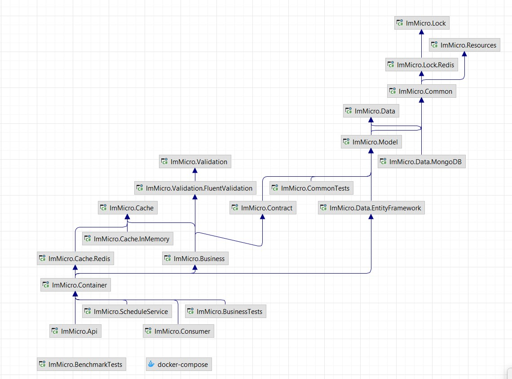

#   **ImMicro(UnderDevelopment)**
    
This is a simple/reusable microservice template/playgorund project.  

#### Features
- Full Login flow
- Full User CRUD flow

#### Structure
- **API:** Endpoint project for client usage  
- **Business:** Project for business logic        
- **Common:** Cross cutting consern items (like cache, lock...)   
- **Container:** DI configuration project   
- **Contract:** Dtos, layer transfer and api response - request objects   
- **Data:** Database layer files (EfCore implementations and repositories)    
- **Model:** Database entity models   
- **Resources:** Language resx files project   
- **Messaging/Consumer:** Message service(RabbitMQ) implementation project
- **ScheduleService:** Schedule tasks project   
  

#### Technologies

* .Net 6.0 - C# 10.0
* Asp .Net Health Check  
* EF Core 6.0  
* Postgres Sql  
* Redis 
* RabbitMQ
* MassTransit
* Hangfire  
* Serilog  
* NWebSec  
* Autofac  
* FluentValidation  
* Swagger  
* RedLock  
* AutoMapper  
* Docker
* HelpersToolbox (https://github.com/turhany/HelpersToolbox)
* Filtery (https://github.com/turhany/Filtery)
* Audity (https://github.com/turhany/Audity)

#### Before Usage
* If you want to use local environment, you need to update Redis and PostgreSql connection strings in API project  (appsettings.json)    
    * **DBConnectionString** field for PostgreSql
    * **RedisConnectionString** field for DistributedCache
    * **Distributed Lock Settings**
        * RedLockHostAddress
        * RedLockHostPort
        * RedLockHostPassword > if you dont have pass you need to set it null
        * RedLockHostSsl
* Also project has ready to run **Docker support**
    * **docker-compose file store in solution directory**
    * All connection string stores in appsettings.DockerCompose.json environment file

#### For local Development - Docker Run Codes
* **PostgreSQL >**  docker run --name postgressqlcontainer -p 5432:5432 -e POSTGRES_PASSWORD=123456789.tY -d postgres
* **Redis >** docker run --name redis -p 6379:6379 -d redis --requirepass 123456789.tY

#### EF Migration Codes
* update-database -context ImMicro.Data.DataContext
* add-migration migrationName -context ImMicro.Data.DataContext

#### Usages
* Application has multi language support for demo pupose now TR and EN
* Before request auth need endpoints like User and Product endpoints first need to Login over login/token enpoint
    * **Accept-Language** can set "tr-TR" or "en-US"
    * **Login Email:** user@immicro.com
    * **Login Pass:** 123456789.tY
* When you get token from **login/token** Endpoint **"accessToken"** field can set swagger **"Authorize"** area with **"Bearer {accessToken}"** syntax

#### Swagger Endpoint   
* http://localhost:5000/swagger/index.html

#### Schedule Service Hangfire Endpoint   
* http://localhost:5001/hangfire

#### Healt Check Endpoints   
* http://localhost:5000/health-check    > json response endpoint for health information
* http://localhost:5000/health-check-ui > Dashboard for see application services health (Redis, NpgSql)    

#### Code Coverage
* will be added

#### SonarQube Test Results
* will be added
